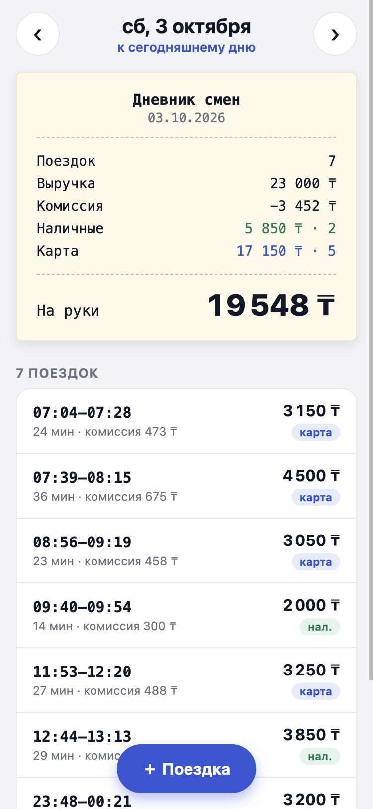
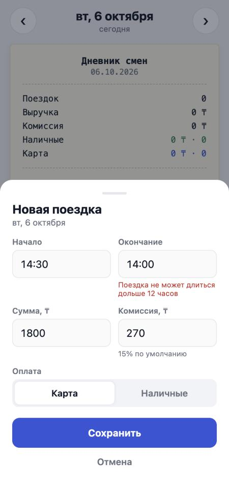

# Дневник смен водителя

Тестовое задание для arqa: сервер отдаёт поездки и сводку за день, мобильное приложение показывает её и даёт добавить поездку. Повторная отправка поездки не создаёт дубль.

**Живое демо: https://arqa-shift-diary.pages.dev** — открывается в браузере, в том числе с телефона. Работает на Cloudflare (Pages + D1), поездки можно добавлять: они сохраняются в базе демо.

**Стек:** TypeScript целиком. Сервер на Hono: один и тот же HTTP-код работает локально в Node поверх SQLite (встроенный `node:sqlite`) и в Cloudflare Workers поверх D1. Клиент на Expo (React Native), работает на iOS, Android и в браузере. Общий пакет `@shift-diary/core` с расчётом сводки и правилами валидации используют и сервер, и клиент.

<p>
  
  
  
</p>

## Запуск

Нужен Node.js 22.13 или новее (проверено на 24).

```bash
npm install
npm test                # 89 тестов: ядро, API на двух хранилищах, логика формы
npm run dev:server      # API на http://localhost:3000, при старте грузит data/trips.json
npm run dev:app         # Expo: w — браузер, i — iOS-симулятор, a — Android, QR — Expo Go на телефоне
```

Продакшен-сборка, как на демо: `npm run build && npm start` — сервер раздаёт и веб-версию приложения, и API на http://localhost:3000.

На телефоне через Expo Go приложение само найдёт сервер по IP ноутбука, с которого Metro раздаёт бандл. Другой адрес можно задать через `EXPO_PUBLIC_API_URL=http://192.168.1.10:3000`.

Переменные сервера: `PORT` (3000), `DB_PATH` (`shift-diary.db`, `:memory:` для базы в памяти), `TIME_ZONE` (`Asia/Almaty`), `SEED_FILE` (`data/trips.json`, `none` отключает загрузку), `WEB_DIR` (`app/dist`, папка веб-сборки).

### Cloudflare (демо)

Демо выложено на Cloudflare Pages ([deploy/pages/wrangler.toml](deploy/pages/wrangler.toml)): веб-сборка плюс `_worker.js`, собранный из [server/src/worker.ts](server/src/worker.ts). Worker отвечает на `/api/*`, остальные адреса отдают файлы веб-версии. База — D1 с той же миграцией, что и локально ([server/migrations](server/migrations)). Пустая база при первом запросе заполняется из `data/trips.json`. Тот же Worker можно выложить и как обычный Cloudflare Worker ([server/wrangler.toml](server/wrangler.toml)).

```bash
npm run dev:worker      # Worker локально с локальной D1: http://localhost:8787
npx wrangler d1 create arqa-shift-diary   # один раз; database_id вписать в оба wrangler.toml
npm run deploy          # сборка веб-версии и Worker, миграция D1, выкладка на Pages
```

## Что сделано

### Требования задания

| Требование | Где |
|---|---|
| API: поездки за выбранный день и сводка (число поездок, выручка, комиссия, на руки, наличные и карта) | `GET /api/days/:date`, [server/src/app.ts](server/src/app.ts) |
| Клиент показывает сводку и список, переключает дни | [app/App.tsx](app/App.tsx) |
| Добавление через API с проверкой: сумма > 0, окончание позже начала | `POST /api/trips`, [packages/core/src/trip.ts](packages/core/src/trip.ts) |
| Повторная отправка не создаёт дубль | [server/src/repository.ts](server/src/repository.ts) |
| Тесты на расчёт сводки и защиту от дублей | [packages/core/test](packages/core/test), [server/test/api.test.ts](server/test/api.test.ts) |

### API

```
GET  /api/days/2026-10-01   → { date, timeZone, summary, trips, neighbours: { previous, next } }
GET  /api/days              → дни, в которые есть поездки
POST /api/trips             → 201 создана
                              200 + Idempotent-Replayed: true — такая поездка уже есть, дубль не создан
                              409 — этот id занят поездкой с другими данными
                              400 — не прошла проверку, в ответе issues: [{ field, message }]
```

```bash
curl localhost:3000/api/days/2026-10-01
curl -X POST localhost:3000/api/trips -H 'content-type: application/json' \
  -d '{"id":"t1","start":"2026-10-01T08:10:00+05:00","end":"2026-10-01T08:32:00+05:00","amount":2400,"payment":"card","commission":360}'
# повторите команду: ответ 200 вместо 201, поездка в базе одна
```

## Решения и почему

**Защита от дублей.** Ключ идемпотентности — `id` поездки. Клиент генерирует его один раз, когда открывается форма (UUID), поэтому и автоповтор, и повторное нажатие «Сохранить» после обрыва связи несут тот же `id`. На сервере стоит `INSERT … ON CONFLICT (id) DO NOTHING`: при гонке двух одинаковых запросов вставит ровно один, это гарантирует PRIMARY KEY в базе, а не проверка в коде. Если строка не вставилась, сервер сравнивает содержимое: та же поездка — отвечает 200 без изменений, другая — 409. Молча перезаписывать данные по чужому `id` нельзя. Моменты времени сравниваются как моменты: `08:10+05:00` и `03:10Z` — одна и та же поездка.

**Деньги — целые тенге.** Без float нет ошибок вида `0.1 + 0.2`. В базе стоят CHECK-ограничения (сумма > 0, комиссия от 0 до суммы, окончание позже начала) как вторая линия защиты после валидации.

**День считается по времени водителя, а не по UTC.** Поездка в 01:30 по Алматы относится к «сегодня», хотя в UTC это ещё «вчера». Поездка через полночь относится ко дню, в котором началась. Часовой пояс сервера — `Asia/Almaty` (Казахстан с 2024 года живёт в едином UTC+5). В реальном продукте пояс брался бы из профиля водителя или парка.

**Одни правила на клиенте и сервере.** Форма проверяет поездку тем же `parseTrip` из `@shift-diary/core`, что и сервер, поэтому сообщения совпадают и не расходятся со временем. Сервер всё равно проверяет всё сам: клиенту доверять нельзя.

**Поездка не дольше 12 часов.** Это правило добавлено после ручной проверки: если окончание по часам меньше начала, форма считает, что поездка перешла через полночь. Без ограничения ввод «14:30 → 14:00» превращался в поездку на 23,5 часа.

**Клиент:**
- быстрое листание дней отменяет старые запросы (AbortController), и поздний ответ за «вчера» не перетирает «сегодня»;
- запрос с таймаутом 8 секунд, при ошибке сети или 5xx три попытки с экспоненциальной паузой;
- при ошибке 4xx повтора нет: он не поможет;
- состояния загрузки, ошибки с кнопкой «Повторить», pull-to-refresh;
- пустой день показывает переход к ближайшим дням с поездками; если при первом открытии сегодня смены не было, приложение само показывает последний день с поездками и сообщает об этом;
- комиссия по умолчанию подставляется как 15%, её можно изменить;
- сводка оформлена как чек, в стиле страницы вакансии.

**Почему SQLite и D1.** Задаче нужна транзакционная уникальность по `id` и запросы по дню. SQLite даёт и то и другое без внешнего сервиса, а встроенный `node:sqlite` не требует компиляции нативных модулей. Cloudflare D1 — тот же SQLite, поэтому схема и SQL общие. Хранилище спрятано за интерфейсом `TripStore` с двумя реализациями, а логика идемпотентности (`addTrip`) одна на обе. Для продакшена так же добавляется PostgreSQL: `ON CONFLICT DO NOTHING` там работает так же.

## Тесты

```
packages/core   27 тестов: сводка (пример из вакансии, пустой день, инварианты на 200 поездках,
                большие суммы), валидация, часовые пояса, переход через полночь
server          52 теста: весь набор API гоняется на двух хранилищах — SQLite и D1
                (D1-адаптер поверх того же движка): API дня, границы дней, 10 одновременных
                повторов → 1 поездка, 409 при конфликте, повторная загрузка демо-данных;
                отдельно — повтор после перезапуска сервера и раздача веб-версии
app             10 тестов: сборка поездки из формы, ночные поездки, форматирование денег
```

Тесты на дубли проверены «от обратного»: если сломать защиту от дублей (заменить `DO NOTHING` на `DO UPDATE` или заставить хранилище D1 всегда отвечать «вставлено»), тесты падают. CI (GitHub Actions) на каждый push запускает проверку типов, все тесты и сборку веб-версии. Тесты не зависят от часового пояса машины: проверены с `TZ=UTC` и `TZ=America/Los_Angeles`.

## Как я использовал ИИ

Работал в Claude Code: обсуждал архитектуру, генерировал код и тесты, потом проверял результат сам — читал код, запускал приложение и проходил сценарии руками. Ниже реальные случаи, где ИИ ошибся.

1. **Сравнение дат строками в базе.** Первая версия схемы проверяла `CHECK (end > start)` на ISO-строках. Для `08:10+05:00` и `03:00Z` строковое сравнение даёт неверный результат. Заметил при чтении схемы и перешёл на сравнение миллисекунд (`end_ms > start_ms`).
2. **Ошибка zod на английском в интерфейсе.** Тесты были зелёными, но при ручной проверке пустое поле суммы показало «Invalid input: expected number, received NaN». Добавил понятные сообщения для ошибок типа и тест.
3. **Поездка на 23,5 часа.** Логика «окончание меньше начала — значит, через полночь» приняла опечатку 14:30 → 14:00 как поездку на почти сутки. Тесты этого не ловили, потому что такой случай в них не проверялся. Нашёл руками в форме, добавил лимит 12 часов в общие правила и регрессионные тесты.
4. **Неверный тест.** ИИ написал тест, который ожидал при сумме 0 только две ошибки, хотя комиссия 360 при сумме 0 законно даёт третью. Ошибался тест, а не код. Поправил данные теста, а не логику.
5. **«Тесты зелёные» не значит «работает».** После исправления браузер продолжал показывать старое поведение. Вместо того чтобы поверить, что исправление сработало, проверил содержимое бандла: Metro не заметил изменения в общем пакете. Перезапустил с очисткой кэша.
6. **Проверка, что тесты вообще что-то проверяют.** Попросил ИИ сломать защиту от дублей и убедился, что тесты падают.

Вывод: ИИ сильно ускоряет работу с шаблонным кодом и тестами, но граничные случаи вроде часовых поясов, полуночи и денег приходится продумывать и проверять самому.

## Структура

```
packages/core/   расчёт сводки, валидация, работа с днями (общий для сервера и клиента)
server/          HTTP-слой на Hono, хранилища SQLite и D1, точки входа для Node и Cloudflare Workers
app/             Expo-приложение
data/trips.json  демо-данные: пример из задания и ещё 5 дней, включая поездку через полночь
```

## Что бы сделал дальше

- Авторизация и привязка поездок к водителю; часовой пояс из профиля.
- Офлайн-очередь на клиенте: сохранить поездку локально и отправить, когда появится сеть. Идемпотентность по `id` уже позволяет это сделать безопасно.
- Редактирование и удаление поездок с журналом изменений.
- PostgreSQL и миграции, Docker, e2e-тесты клиента (Maestro или Detox).
